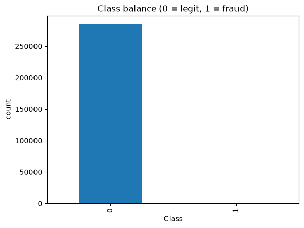
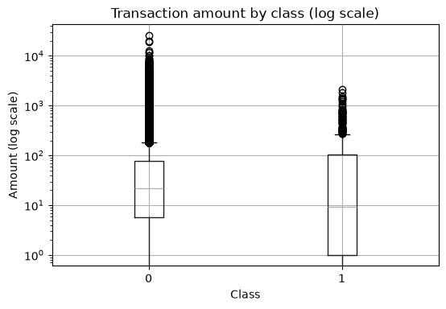
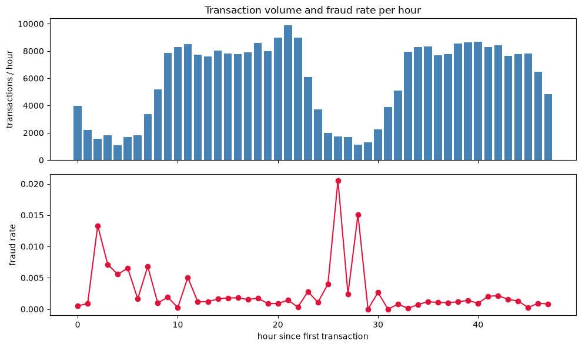
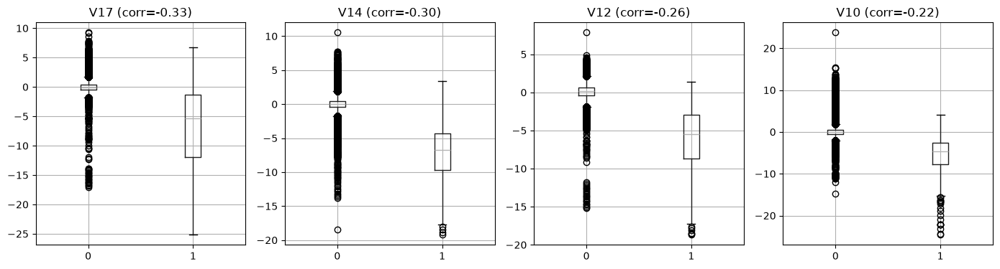
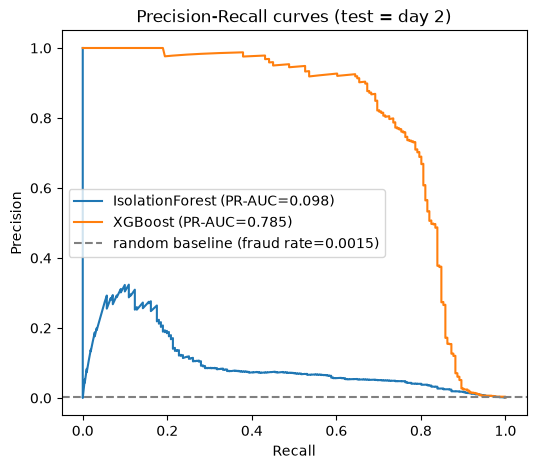
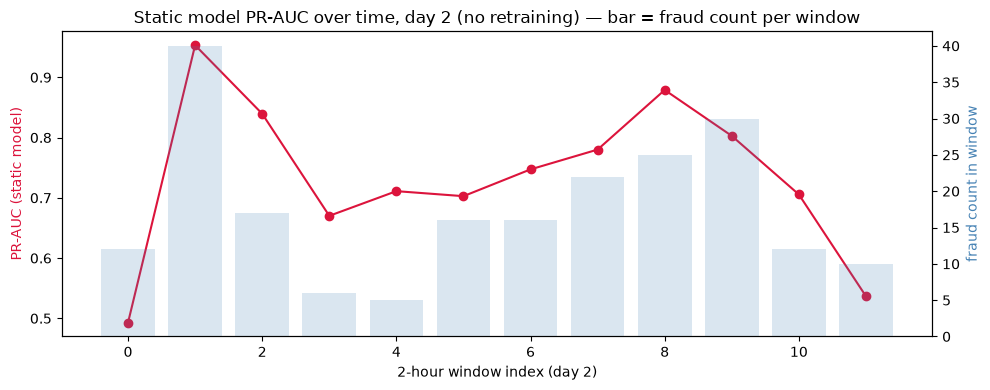
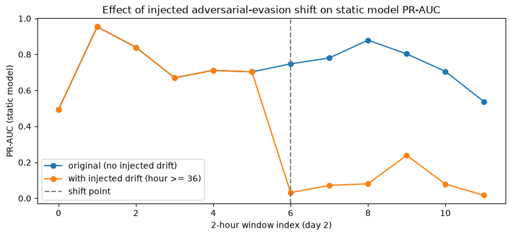
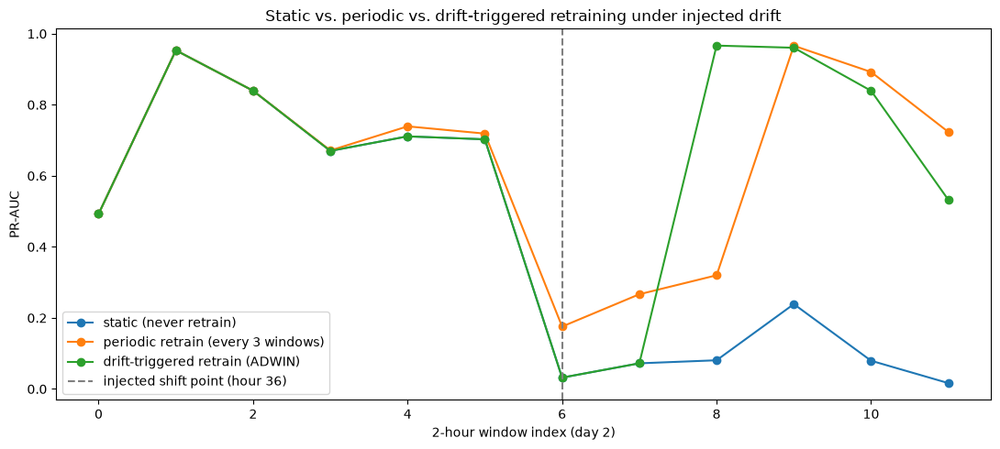
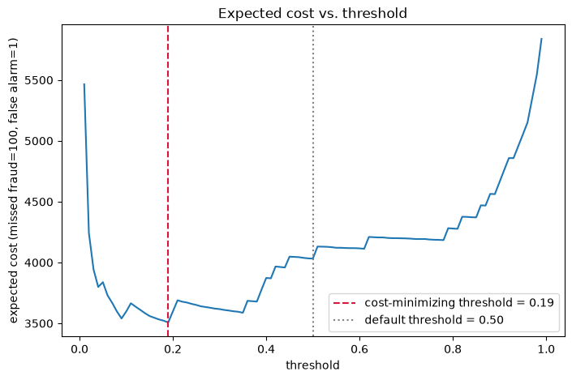
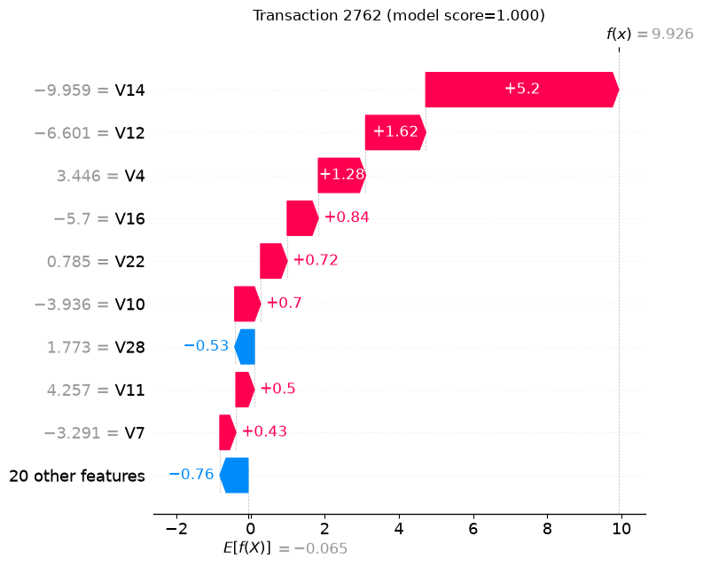

# Adaptive Fraud Detection with Concept Drift + Cost-Aware Explainable Alerts

A fraud detection system that keeps working as fraud patterns change over time, tunes its alert threshold to real business cost instead of accuracy, and explains every flag it raises.

## Problem framing

Most "fraud detection" portfolio projects follow the same shallow pattern: generate synthetic transaction data, run an Isolation Forest and an IQR check, show a demo, done. That pattern doesn't demonstrate anything hard, and it skips the two things that actually make fraud detection difficult in practice:

1. **Extreme class imbalance** — fraud is a fraction of a percent of transactions, so accuracy is a meaningless metric and needs to be replaced with something that reflects the real tradeoff.
2. **Concept drift** — a model trained once decays as fraud patterns change, and most tutorial-grade projects never touch this because it requires more than a single train/test split.

This project uses real, publicly available fraud data, a time-based (not random) evaluation split, cost-based thresholding instead of a default 0.5 cutoff, and an explicit concept-drift study comparing static, periodic, and drift-triggered retraining strategies — with a live dashboard demonstrating the whole pipeline end to end.

## Data

[Credit Card Fraud Detection](https://www.kaggle.com/datasets/mlg-ulb/creditcardfraud) (Kaggle, ULB/Worldline) — 284,807 European card transactions over roughly 2 days, 492 fraudulent (0.1727%). Features `V1`-`V28` are PCA-anonymized; `Time` (seconds since the first transaction) and `Amount` are raw. The dataset doesn't specify a currency; given its European origin, `Amount` is most likely EUR.

## Methodology and results, phase by phase

### Phase 1 — Exploratory data analysis



- **Extreme class imbalance.** 492 of 284,807 transactions are fraud (0.1727%). A classifier that always predicts "not fraud" scores 99.83% accuracy while catching zero fraud — the concrete reason accuracy is banned as a metric for the rest of this project.



- **`Amount` gives a weak, mixed signal.** Fraud's median amount (9.25) is *lower* than legit's (22.00) — most fraud is small-value — but fraud's mean (122.21) is *higher* than legit's mean (88.29) because of a handful of larger frauds. Fraud amounts never exceed ~2,125, while legit amounts reach 25,691.



- **Fraud rate is not flat over time, but the evidence for organic drift is ambiguous.** Hourly fraud rate ranges from 0% to 2.05% (mean 0.27%), tending to spike during low-volume overnight hours. Each hourly bin only contains ~10 frauds on average, so a meaningful part of this swing is plausibly small-sample statistical noise rather than a genuine behavior change — a question deliberately left open for Phase 3 to test rigorously rather than concluding from a chart alone.



- **The anonymized `V1`-`V28` features carry real signal.** `V17` (r=-0.33), `V14` (r=-0.30), `V12` (r=-0.26), and `V10` (r=-0.22) correlate most strongly with `Class` and visibly separate the two classes, despite being uninterpretable PCA components.
- **Transaction volume follows a clear day/night cycle**, confirming the dataset genuinely spans two calendar days — the basis for the time-based split used in every later phase.

### Phase 2 — Baseline models

Trained on day 1, evaluated on day 2 — a time-based split, not a random one, so the model never sees the "future" during training.

| Model | PR-AUC | Recall @ Precision≥0.9 |
|---|---|---|
| IsolationForest (unsupervised) | 0.098 | 0.0% |
| XGBoost (supervised) | 0.785 | 66.8% |



XGBoost massively outperforms IsolationForest: at a 0.5 threshold, XGBoost catches 172/211 frauds (81.5% recall) with 132 false alarms (56.6% precision), while IsolationForest's own built-in threshold catches slightly more frauds (177/211, 84%) but drowns them in 6,268 false alarms (2.7% precision) — unusable for a human reviewer. This makes sense: IsolationForest never sees the fraud labels, while XGBoost learns the actual pattern.

### Phase 3 — Concept drift



**Honest finding: this 2-day dataset does not show real concept drift.** PR-AUC per 2-hour window on day 2 ranges from 0.49 to 0.95 with no downward trend, and the noisiest windows are exactly the ones with the fewest fraud cases (a small-sample-size artifact, not decay). This matches the limitation flagged before this project started.

To demonstrate the actual mechanism this project is about, a controlled, clearly-labeled synthetic drift was injected: starting at hour 36, fraud transactions' feature vectors were blended 70% toward the "normal" transaction centroid, simulating fraudsters adapting to evade detection ("adversarial evasion"). This is a deliberate simulation for demonstration, not something observed in the real data.



The injection produces a clean, dramatic effect: pre-shift windows (0-5) are unchanged (PR-AUC 0.49-0.95), post-shift windows (6-11) collapse to PR-AUC 0.02-0.24.

An ADWIN drift detector, fed the catch/miss outcome of confirmed fraud cases in time order (not every transaction — fraud is too rare at ~0.15% for a raw per-transaction signal to move the average), fired at hour 39 — 3 hours after the true injection point, without ever being told where it was.



**The single most important chart in this project.** The static model never recovers — its PR-AUC stays at 0.02-0.24 for the rest of day 2. Both retraining strategies recover: periodic retraining (blind, every 6 hours) catches up by window 9 (PR-AUC 0.97); drift-triggered retraining reacts to the actual detected change and recovers one window (2 hours) sooner, at window 8 (PR-AUC 0.97) — a real, measurable advantage of reacting to evidence over reacting to a fixed clock, though the absolute gap here is modest because the periodic schedule happened to be reasonably tight.

### Phase 4 — Cost-sensitive thresholding and explainability

Every threshold used up to this point (0.5, or IsolationForest's built-in cutoff) was arbitrary. Using an illustrative cost matrix — missed fraud = 100 cost units, false alarm = 1 cost unit (a 100:1 ratio, kept as abstract units since the dataset doesn't specify a currency and these numbers are assumptions, not derived from real business data) — expected cost was computed across all thresholds:



The cost-minimizing threshold is **0.19**, far below the default 0.5, reducing expected cost from 4,034 to 3,507 (13% lower). At this threshold, recall rises from 81.5% to 84.8% (179/211 frauds caught) at the cost of more false alarms (307 vs. 132, precision drops from 56.6% to 36.8%) — exactly the intended tradeoff given that false alarms are 100x cheaper than missed fraud in this cost matrix.



SHAP explanations were generated for individual flagged transactions. Across all three examples inspected, `V14` and `V12` — the same two features found most correlated with `Class` in Phase 1 — dominated the per-transaction explanations (e.g. one transaction was flagged almost entirely due to `V14 = -9.96`, contributing +5.20 to the fraud score, and `V12 = -6.60`, contributing +1.62). The global feature-importance pattern from Phase 1 and the per-transaction SHAP reasoning agree, rather than SHAP surfacing some feature the earlier analysis never flagged.

### Phase 5 — Live demo dashboard

`app/streamlit_app.py` replays day-2 transactions (using the Phase 3 injected-drift scenario, so the drift alarm has something real to react to) through the trained model in batches, showing live flagged alerts with SHAP-based plain-text explanations, running recall/precision/cost metrics, a drift alarm indicator, and an automatic retrain triggered by the same ADWIN detector from Phase 3. Verified live: the dashboard detected the injected drift and retrained at hour 39 — matching Phase 3's notebook finding almost exactly. Run it with:

```bash
streamlit run app/streamlit_app.py
```

## Limitations

- **The dataset only covers 2 days.** All "drift" shown in Phase 3 past the honest no-drift finding is a deliberately injected, clearly-labeled simulation, not organically observed real-world drift. A production system would need a much longer time horizon to study genuine drift.
- **`V1`-`V28` are PCA-anonymized.** We can identify which features matter statistically (`V14`, `V12`, `V17`, `V10`) but not what they represent physically, which limits how actionable the explanations can be for building a fraud typology.
- **The cost matrix (100:1 ratio) is an illustrative assumption**, not derived from real chargeback costs, investigation overhead, or customer-friction costs. A real deployment would need those numbers from an actual risk/finance team.
- **Labels are treated as immediately available** for drift detection and retraining, both in Phase 3 and the Phase 5 demo. In reality, fraud labels arrive with delay (e.g. chargeback disputes can take weeks), which would slow real-world drift response considerably compared to what's shown here.
- **Only one supervised model family (XGBoost) was used**, without extensive hyperparameter tuning or comparison against other architectures.
- **The Streamlit demo replays historical data in batches**, not a true real-time streaming pipeline.

## What I'd do with more time or data

- Extend to the **IEEE-CIS Fraud Detection** dataset (longer time span, richer categorical features) to look for organic drift rather than simulated drift.
- Simulate realistic **delayed labels** (the lag between a transaction and its confirmed fraud status) to stress-test drift detection under real-world label latency, instead of assuming labels are known immediately.
- Replace the batch replay with **real-time ingestion** (e.g. Kafka) for a genuinely streaming pipeline.
- Tune hyperparameters and compare against additional model families (e.g. LightGBM).
- Work with a real risk/finance team to replace the illustrative cost matrix with actual costs.
